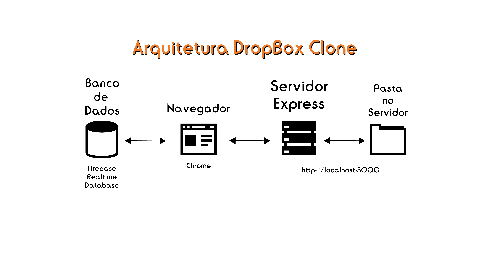

	

  

  <a aria-label="Completed" href="https://github.com/edibertooliveira/Dropbox-Clone">
    </img>
  </a>
   

  
  
   

> :rocket: Project developed as an example of the Complete JavaScript Course. I will get knowledge of firebase and how I work in architecture.

   

